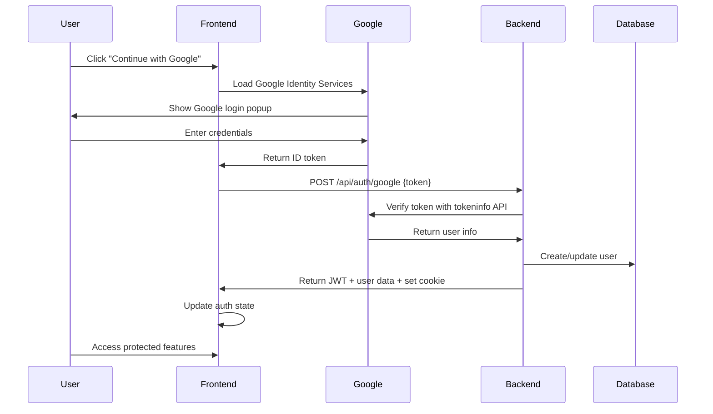

# 🔐 Authentication Status Summary

## Current Configuration Status

### ✅ **Working Components**
- Google OAuth integration (backend + frontend)
- JWT token management and validation
- User session management with HTTP-only cookies
- Protected API routes with user authentication
- User registration and login flow
- Secure password-free authentication

### ⚡ **Ready for Local Development**

**Backend Authentication (`/app/backend/auth.py`):**
- ✅ Google OAuth token verification
- ✅ JWT token creation and validation  
- ✅ User creation and management
- ✅ Session management with cookies
- ✅ Protected route dependencies

**Frontend Authentication (`/app/frontend/src/`):**
- ✅ Google Login component with Google Identity Services
- ✅ Auth Context for state management
- ✅ Protected routes implementation
- ✅ Automatic session restoration
- ✅ Logout functionality

**Security Features:**
- ✅ HTTP-only cookies (secure=false for localhost)
- ✅ JWT with secure secret (86 characters)
- ✅ CORS properly configured for localhost
- ✅ User-specific data isolation
- ✅ Token expiration (7 days)

### 🔧 **Configuration Fixed**
- ✅ Secure JWT secret generated
- ✅ Cookie security configured for localhost (`secure=false`)
- ✅ Frontend/backend Client IDs synchronized
- ✅ Google OAuth endpoint accessibility verified

## Authentication Flow



## API Endpoints

### Authentication Routes
- `POST /api/auth/google` - Google OAuth login
- `GET /api/auth/me` - Get current user info  
- `POST /api/auth/logout` - Logout and clear session

### Protected Routes (require authentication)
- `POST /api/upload` - Upload documents
- `GET /api/documents` - Get user's documents
- `GET /api/documents/{id}/*` - Document-specific operations
- `POST /api/chat` - AI tutor chat

## Testing Authentication

### Quick Test
```bash
# Test OAuth configuration
python test_google_auth.py

# Should show all green checkmarks ✅
```

### Manual Test Flow
1. Start servers: `python start_development.py`
2. Go to: `http://localhost:3000`
3. Click "Continue with Google"
4. Complete Google login
5. Verify redirect back to app
6. Check user info appears in header
7. Test logout functionality

### Expected Behavior
- ✅ Redirects to Google login
- ✅ Returns to app after login
- ✅ Shows user name and picture
- ✅ Persists session on page refresh
- ✅ Protects routes (redirects unauthenticated users)
- ✅ Allows logout

## Troubleshooting

### If Login Fails
1. Check browser console for errors
2. Run `python test_google_auth.py`
3. Verify Google Cloud Console configuration
4. Check backend logs for authentication errors

### Common Issues
- **CORS errors:** Check CORS_ORIGINS in backend/.env
- **Cookie issues:** Verify secure=false for localhost
- **Token errors:** Check Google Client ID configuration
- **Redirect errors:** Verify authorized URLs in Google Console

### Debug Commands
```bash
# Check environment variables
cd backend && python -c "from dotenv import load_dotenv; load_dotenv('.env'); import os; print('GOOGLE_CLIENT_ID:', os.environ.get('GOOGLE_CLIENT_ID'))"

# Test backend startup
cd backend && uvicorn server:app --reload

# Test frontend startup  
cd frontend && yarn start
```

## Production Considerations

When deploying to production:

1. **Update OAuth Configuration:**
   - Change authorized origins to your production domain
   - Use HTTPS redirect URIs
   - Create production-specific OAuth client

2. **Security Updates:**
   - Set `secure=True` in cookie configuration
   - Generate new JWT secret for production
   - Enable HTTPS enforcement
   - Update CORS to production domain

3. **Environment Variables:**
   - Use production MongoDB connection string
   - Update REACT_APP_BACKEND_URL to production API
   - Secure environment variable storage

---

**Status:** ✅ Authentication system is ready for local development
**Next Steps:** Follow GOOGLE_OAUTH_SETUP.md if you need to create your own OAuth credentials